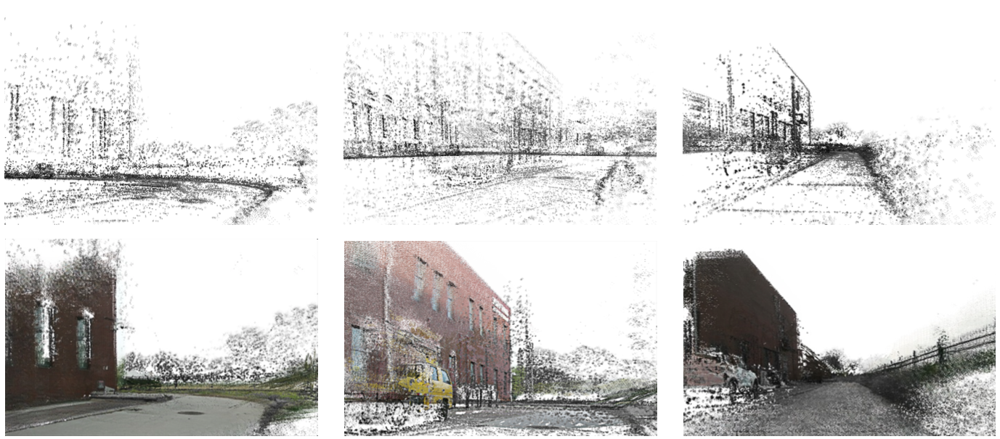
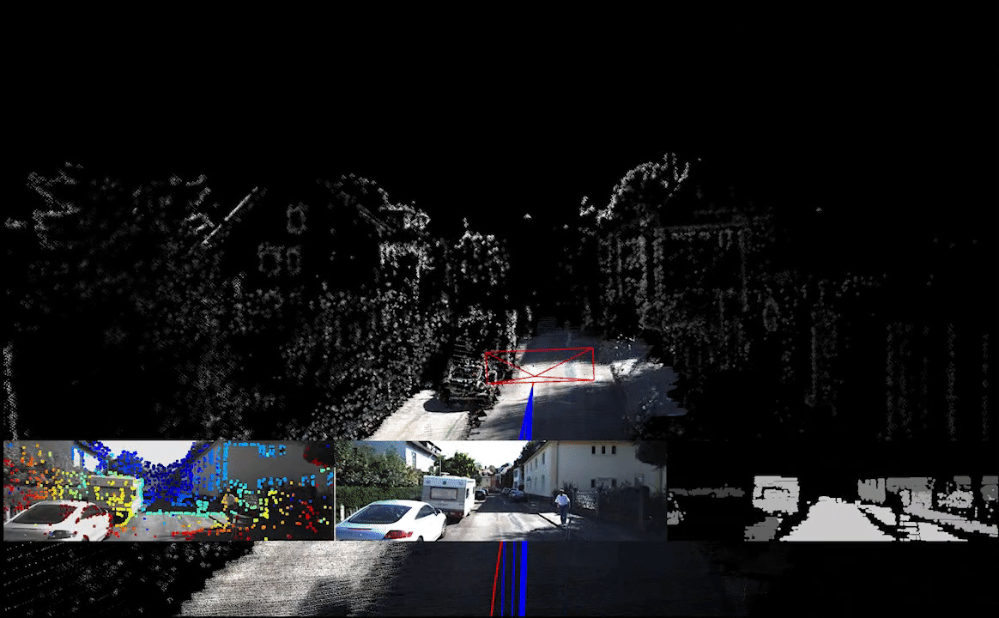

# NALO-SLAM
## NALO-SLAM: Navigation-Oriented LiDAR-guided Monocular SLAM for Mobile Robots

## 1. Introduction
**NALO-SLAM** is a monocular SLAM system that we designed based on the direct method framework [DSO](https://github.com/JakobEngel/dso). NALO-SLAM integrates geometrical prior learned from 3D LiDAR offline into the state estimation and map reconstruction. Benefiting from the prior information, dense frontend tracking and relative scale constrain are performed. In addition, a dense environment map is reconstructed using point surfels, which makes the map more friendly for mobile robot navigation compared to sparse maps built by other visual SLAM work (e.g., [ORB-SLAM2](https://github.com/raulmur/ORB_SLAM2), [DSO](https://github.com/JakobEngel/dso), etc).

    

The reconstructed dense 3D maps of NALO-SLAM are shown on the second row, compared to the sparse maps built by DSO on the first row. 

## 2. Installation

	git clone https://github.com/huziqi/NALO-SLAM.git

### 2.1 Required Dependencies

#### suitesparse and eigen3 (required).
Required. Install with

		sudo apt-get install libsuitesparse-dev libeigen3-dev libboost-all-dev

### 2.2 Optional Dependencies

#### OpenCV (highly recommended).
Used to read / write / display images.
OpenCV is **only** used in `IOWrapper/OpenCV/*`. Without OpenCV, respective 
dummy functions from `IOWrapper/*_dummy.cpp` will be compiled into the library, which do nothing.
The main binary will not be created, since it is useless if it can't read the datasets from disk.
Feel free to implement your own version of these functions with your prefered library, 
if you want to stay away from OpenCV.

Install with

	sudo apt-get install libopencv-dev

#### Pangolin (highly recommended).
Used for 3D visualization & the GUI.
Pangolin is **only** used in `IOWrapper/Pangolin/*`. You can compile without Pangolin, 
however then there is not going to be any visualization / GUI capability. 
Feel free to implement your own version of `Output3DWrapper` with your preferred library, 
and use it instead of `PangolinDSOViewer`

Install from [https://github.com/stevenlovegrove/Pangolin](https://github.com/stevenlovegrove/Pangolin)

#### ziplib (recommended).
Used to read datasets with images as .zip, as e.g. in the TUM monoVO dataset. 
You can compile without this, however then you can only read images directly (i.e., have 
to unzip the dataset image archives before loading them).

	sudo apt-get install zlib1g-dev
	cd dso/thirdparty
	tar -zxvf libzip-1.1.1.tar.gz
	cd libzip-1.1.1/
	./configure
	make
	sudo make install
	sudo cp lib/zipconf.h /usr/local/include/zipconf.h   # (no idea why that is needed).

#### sse2neon (required for ARM builds).
After cloning, just run `git submodule update --init` to include this.  It translates Intel-native SSE functions to ARM-native NEON functions during the compilation process.

### 2.3 Build

		cd NALO-SLAM
		mkdir build
		cd build
		cmake ..
		make -j4
	
this will compile a library `libdso.a`, which can be linked from external projects. 
It will also build a binary `dso_dataset`, to run DSO on datasets. However, for this
OpenCV and Pangolin need to be installed.

## 3 Usage
Run on a dataset from [KITTI](https://www.cvlibs.net/datasets/kitti/eval_odometry.php) using

		bin/dso_dataset \
			files=XXXXX/sequence_XX/images.zip \
			calib=XXXXX/sequence_XX/camera.txt \
			gamma=XXXXX/sequence_XX/pcalib.txt \
			vignette=XXXXX/sequence_XX/vignette.png \
			preset=0 mode=0 dense=1 planeOpt=1 tsdf=1 densemap=1

### 3.1 Commandline Options
most of the explanations of the options can be found at [DSO](https://github.com/JakobEngel/dso). Some new options include
- `dense=X`: enable dense frontend tracking
- `planeOpt=1`: enable relative scale constrain
- `tsdf=1`: save the point cloud map for tsdf
- `densemap`: enable dense 3D reconstruction

## 4 MP-Mask Training
In order to enable mp-masks in NALO-SLAM, the mp-mask prediction network should be trained offline using a encoder-decoder network. Here we adopt a depth estimation network [bts](https://github.com/cleinc/bts) to implement our mp-mask prediction. The details of the training process can be found at [bts](https://github.com/cleinc/bts). The differences are the labels, which come from 3D LiDAR.

### 4.1 Label Generation
Firstly, abundant of image and point cloud pairs should be obtained either from KITTI or own dataset. Here, we take KITTI as the example.
Project point cloud to image plane:
    
    mkdir masks dst_masks
    rosrun make_mask bin2pcd $Path to bins$ $Path to pcds$
    rosrun make_mask project2img $Path to pcds$ $Path to images$ $Path to masks$
    
resize masks:

    cd NALO-SLAM/python
    python3 complish.py $Path to masks$ $Path to dst_masks$ $height of iamge$
    
Then, the images in dst_masks folder are the labels for training.

## 5 License
NALO-SLAM was developed at the Nankai University of Tianjin, China.
The open-source version is licensed under the GNU General Public License
Version 3 (GPLv3).
